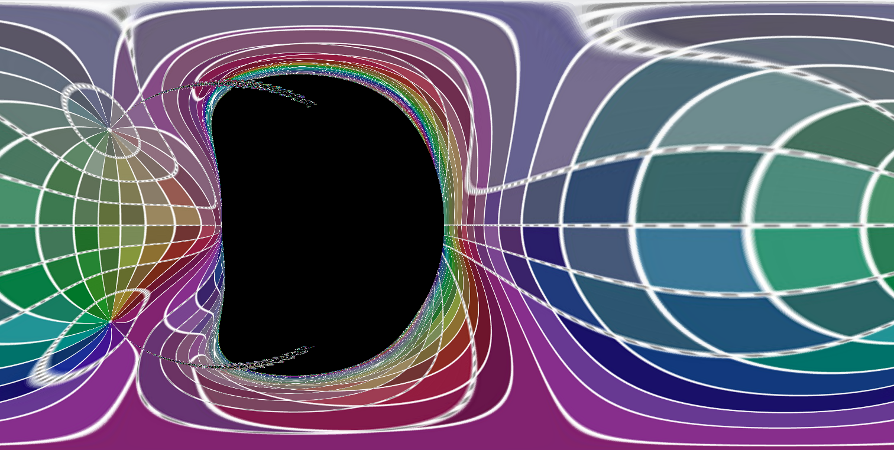

# kerr_black_hole

This project allows you to trace the null geodesics of Kerr spacetime, in other words, it allows you to ray trace a spinning black hole. The code is written in python and operates in multiple processes to increase the efficiency.

## Run

The executable file is ./src/tracer.py, use the -h or --help switches to view the usage options.

## References:

1. James O et al. 2015 Gravitational lensing by spinning black holes in astrophysics, and in the movie Interstellar IOP Publishing

2. Chen B et al. 2015 Algorithms and Programs for Strong Gravitational lensing in KAB The Astrophysical Journal Supplement Series

3. https://github.com/rantonels/starless

